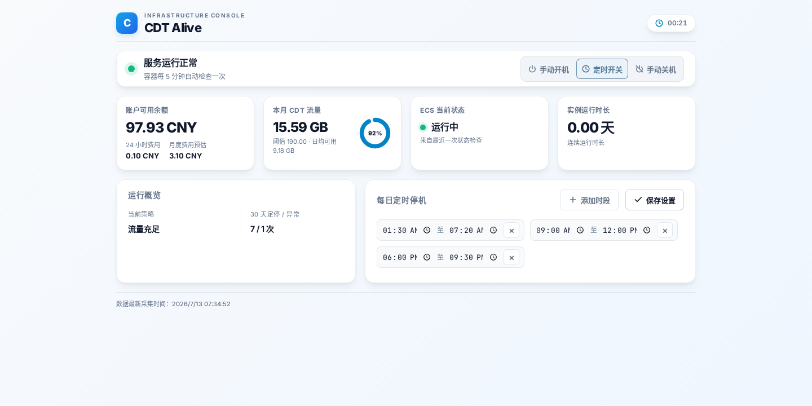

# CDT Alive

面向阿里云抢占式 ECS 的保活服务。无需手动安装 Python 或配置定时任务，下载项目后使用 Docker Compose 部署，并在浏览器中完成首次配置即可运行。

## 快速部署

安装 Docker 后，克隆源码并进入项目目录：

```bash
git clone https://github.com/lyessure/cdtalive.git
cd cdtalive
```

启动服务：

```bash
docker compose up -d --build
```

服务为安全起见默认仅绑定本机回环地址。部署服务器本机可通过 `http://127.0.0.1:5201` 访问，填写 AccessKey、ECS 实例 ID 和阈值即可开始监控；需要远程访问时，推荐通过 Caddy 或 Nginx 反向代理并配置 HTTPS 与访问控制。

- **抢占回收自动恢复**：实例被回收或停止后，在流量和余额正常时自动尝试拉起。
- **费用保护**：CDT 流量达到上限或账户余额不足时自动停机。
- **开箱即用的控制台**：查看流量、余额、实例状态与停机记录，直接调整停机时间和开关机模式。
- **配置持久化**：配置和运行数据保存在本地 `data/` 目录，容器重建后无需重新设置。

服务提供一个中文控制台，可查看余额、当月 CDT 流量、ECS 状态、运行时长和近 30 天停机记录，并可配置每日定时停机时段与开关机模式。

## 功能

- 定时获取 CDT 当月互联网流量与账户可用余额。
- 当 CDT 流量达到阈值时，停止账号下的 ECS 实例，避免超额流量费用。
- 当账户余额低于阈值时，停止账号下的 ECS 实例。
- 在流量和余额均处于安全范围、且未命中手动或定时停机策略时，自动拉起处于停止状态的目标实例，帮助抢占式实例在被回收后尽快恢复运行。
- 支持每天一个或多个定时停机时间段，包含跨天时间段。
- 支持手动强制开机、自动控制和强制关机三种模式。
- 提供首次初始化页面和运行状态控制台；配置及运行数据保存在挂载的数据目录中。

## 策略优先级

每次检查按以下优先级执行：

1. CDT 流量达到阈值：停止账号下的全部 ECS 实例。
2. 手动模式为“强制开机”：启动配置的目标 ECS 实例。
3. 手动模式为“强制关机”：停止配置的目标 ECS 实例。
4. 处于每日定时停机窗口：停止配置的目标 ECS 实例。
5. 账户余额低于阈值：停止账号下的全部 ECS 实例。
6. 其他情况：确认目标实例运行；若实例已被抢占回收或处于停止状态，则发起启动请求。

> **注意：** 流量阈值和余额阈值是账号级保护策略，会操作当前 AccessKey 所在账号下的**全部 ECS 实例**。请使用权限受限的 RAM 用户或确认该账号内实例均可被停止后再部署。

> **适用场景：** 本项目主要用于抢占式 ECS 实例的自动恢复。实例被回收后，阿里云是否能够成功再次分配资源取决于当时的库存和价格等条件；本服务会在下一次检查时持续尝试启动，但不保证实例一定能被立即拉起。

## 详细部署说明

### 前置条件

- Docker。
- 具备阿里云访问凭证的 RAM 用户 AccessKey。
- 该 RAM 用户至少应具备以下 API 的调用权限：
  - `cdt:ListCdtInternetTraffic`
  - `bss:QueryAccountBalance`
  - `ecs:DescribeInstances`
  - `ecs:StartInstances`
  - `ecs:StopInstances`

### 使用 Docker Compose 部署

```bash
docker compose up -d --build
```

服务为安全起见默认仅监听 `127.0.0.1` 的 `5201` 端口。通过部署服务器本机访问：

```text
http://127.0.0.1:5201
```

首次访问会进入初始化页面。填写 AccessKey、目标 ECS 实例 ID、地域、流量阈值、余额阈值和检查间隔后提交即可启动监控。

停止服务：

```bash
docker compose down
```

### 自定义端口

创建 `.env` 文件：

```dotenv
CDT_WEB_PORT=5201
```

将 `CDT_WEB_PORT` 修改为需要的宿主机端口后重新执行 `docker compose up -d`。Compose 默认绑定 `127.0.0.1`，不会直接暴露到公网；如需远程访问，推荐使用 Caddy 或 Nginx 反向代理，并配置 HTTPS 与访问控制。

## 配置方式

首次初始化完成后，配置保存至 `data/cdtalive.yaml`，文件权限会自动设为仅属主可读写。也可以在启动前手动创建该文件：

```yaml
access_key_id: LTAIxxxxxxxxxxxx
access_key_secret: xxxxxxxxxxxxxxxxxxxx
ecs_instance_id: i-xxxxxxxxxxxxxxxxx
region_id: cn-hongkong
traffic_threshold_gb: 190.0
balance_threshold_cny: 1.0
run_interval_seconds: 300
daily_stop_windows:
  - "01:00-06:00"
power_mode: auto
```

容器支持以下环境变量覆盖对应配置：

| 环境变量 | 说明 | 默认值 |
| --- | --- | --- |
| `CDT_ACCESS_KEY_ID` | 阿里云 AccessKey ID | 无 |
| `CDT_ACCESS_KEY_SECRET` | 阿里云 AccessKey Secret | 无 |
| `CDT_ECS_INSTANCE_ID` | 自动启停的目标 ECS 实例 ID | 无 |
| `CDT_REGION_ID` | ECS 地域 ID | `cn-hongkong` |
| `CDT_TRAFFIC_THRESHOLD_GB` | CDT 流量停机阈值，单位 GB | `190` |
| `CDT_BALANCE_THRESHOLD_CNY` | 账户余额停机阈值，单位 CNY | `1` |
| `CDT_RUN_INTERVAL_SECONDS` | 常规检查间隔，最小 60 秒 | `300` |
| `CDT_DAILY_STOP_WINDOWS` | 停机时段，多个时段用英文逗号分隔 | 空 |
| `CDT_POWER_MODE` | `on`、`auto` 或 `off` | `auto` |
| `CDT_WEB_PORT` | 宿主机 Web 端口，仅 Compose 使用 | `5201` |

`daily_stop_windows` 的格式为 `HH:MM-HH:MM`。例如 `22:00-07:00` 表示跨天停机，`01:00-06:00,12:00-13:00` 表示两个停机窗口。

## Web 控制台

控制台首页提供：



- 最新余额、近 24 小时支出和月度费用估算。
- 当月 CDT 流量、流量阈值和剩余天数的日均可用流量。
- ECS 当前状态、连续运行时长、计划停机和异常停机次数。
- 每日停机时段与电源模式设置。
- 手动立即执行一次检查。

服务在 ECS 启停过渡状态期间会每 15 秒仅刷新实例状态；其他情况下按配置的检查间隔执行完整检查。

## 数据持久化

Compose 将本地 `./data` 目录挂载到容器 `/data`。其中包含：

| 文件 | 用途 |
| --- | --- |
| `cdtalive.yaml` | 应用配置及敏感访问凭证 |
| `cdtalive_status.json` | 最近一次执行结果 |
| `latest_metrics.json` | 最近一次流量指标 |
| `cdtbal.json` | 最近 48 小时余额记录 |
| `ecs_status_history.json` | ECS 状态与近 30 天停机记录 |

请勿将 `data/`、`.env` 或任何 AccessKey 提交到 Git 仓库。项目已在 `.gitignore` 中忽略这些路径。

## 本地开发

需要 Python 3.12 或更高版本：

```bash
python -m venv .venv
source .venv/bin/activate
pip install -r requirements.txt
export CDT_CONFIG_FILE="$PWD/data/cdtalive.yaml"
export CDT_DATA_DIR="$PWD/data"
uvicorn app.web:app --reload --host 127.0.0.1 --port 8080
```

访问 `http://127.0.0.1:8080` 完成初始化。

## API

| 方法 | 路径 | 说明 |
| --- | --- | --- |
| `GET` | `/` | 初始化页或控制台首页 |
| `GET` | `/api/status` | 最近一次执行状态 |
| `GET` | `/api/dashboard` | 控制台聚合数据 |
| `GET` | `/api/settings` | 当前停机时段与电源模式 |
| `PUT` | `/api/settings` | 更新停机时段与电源模式，并立即执行检查 |
| `POST` | `/api/init` | 首次写入配置 |
| `POST` | `/api/run` | 立即执行一次检查 |

## 安全建议

- 使用专用 RAM 用户和最小权限策略，不要使用主账号 AccessKey。
- 通过反向代理、VPN 或防火墙限制控制台访问来源。应用本身未提供登录认证。
- 生产环境中将 `data/` 放在受保护、可备份的持久化存储中。
- 部署前请先确认阈值策略对账号内所有 ECS 实例的影响。
